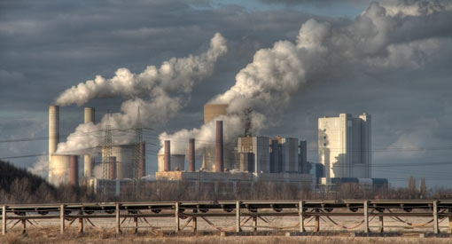
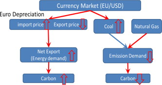
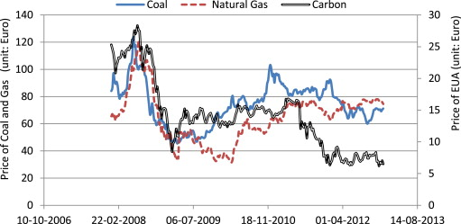
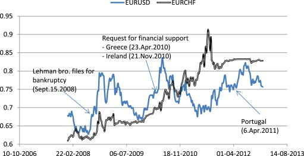
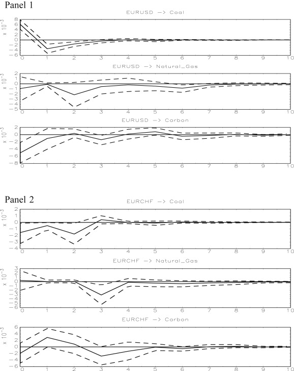
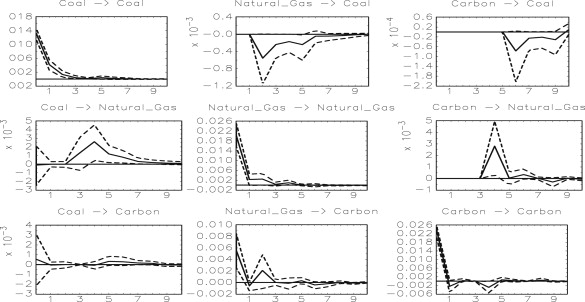
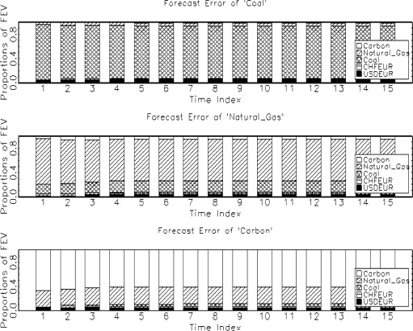

Exchange rate effect on carbon credit price via energy markets
========================================================
author: Jongmin Yu and Mindy Mallory 
date: May 6, 2015
transition: none
Hongik University and University of Illinois  

IPAM UCLA, Commodity Markets and thier Financialization

Background
========================================================
From European Union Emissions Trading System (EU ETS) [factsheet](http://ec.europa.eu/clima/publications/docs/factsheet_ets_en.pdf)

- "Cap and Trade" First large greenhouse gas emission trading scheme. Still largest.
- Covers 11,000 factories, power stations, etc. 
- 31 Countries. 28 EU member states plus Iceland, Norway, and Liechtenstein

Background
========================================================
EU ETS [factsheet](http://ec.europa.eu/clima/publications/docs/factsheet_ets_en.pdf)
- Emission allowances (emission credits) are allocated at the beginning of a trading period
- 1st period: Jan 2005 - Dec. 2007
- 2nd period: Jan 2008 - Dec. 2012
- 3rd period: Jan 2013 - Dec. 2020
 + One allowance gives the holder the right to emit one tonne $CO_2$
 + Proposed cap for 2020 represents a 20% reduction in greenhouse gas emissions (ghg) from 2005

Background
========================================================
- In 1st and 2nd trading period initial allocations were more or less given away free by governments 
- From 3rd period initial allocations are to be auctioned off
- After initial allocations are made firms can trade these credits
- -> Carbon market and Carbon prices

Objectives
========================================================
- Coal is "dirty" and denominated in USD
- Natural gas is "clean" and denominated in Euro

1. What effect does the **EURO/USD** exchange rate have on relative **energy prices**?
2. What effect does the **EURO/USD** exchange rate have on **carbon credit prices**?

***
<figure>
  
  <figcaption>Coal fired power plant 
  </figcaption>
</figure>

<figure>
  
  <figcaption>Natual Gas Well (Wikimedia Commons) 
  </figcaption>
</figure>

.emphasized { font-size: 8pt}
source: Wikimedia Commons

Conceptual Framework
========================================================

Conceptual Framework
========================================================
incremental: true

$$P_{carbon} = f(P_{relative price}(Exchange Rate), D_{export}(Exchange Rate)|\Omega) $$

Taking the total derivative with respect to the exange rate we see a substitution effect and a demand effect. 

$$ \begin{align*}
\frac{dP_{carbon}}{dExchange Rate} = \frac{dP_{carbon}}{dP_{Relative Price}}  \frac{dP_{Relative Price}}{dExchange Rate}  \\ + \frac{dP_{carbon}}{dD_{export}} \frac{dD_{export}}{dExchangeRate}
\end{align*}$$

Carbon prices respond to exchange rates because:

1. Substitution effect: exchange rates influence the relative price of clean and dirty energy (coal is denominated in USD and natural gas is denominated in EURO).
2. Demand effect: a depreciated EURO increases demand for exports.

Data
========================================================

Figure 2

Data
========================================================

Figure 3

Data Pretesting
========================================================
Table 2: Pretests for model selection.

Augmented Dickey Fuller unit root test

|         |Model | Lags	|5%	    |Statistics|	Result         |
|--------:|-----:|-----:|------:|---------:|----------------:|
|Carbon   |	NCNT|	7	    |−1.94  |	−1.57    |	Non-stationary |
|Coal	    | NCNT| 1     |	−1.94 |	−0.35    |	Non-stationary | 
|Natural gas|CNT|	9	    | −2.86 |	−2.08    |	Non-stationary |
| Euro/USD|	CNT |	0	    |−2.86  |	−2.11    |	Non-stationary |
|Euro/SFr |	CT  |	8     |	−3.41 |	−2.26    |	Non-stationary |
|ΔCarbon  |	NCNT|	0     |	−1.94	|−6.31     |	Stationary     |
|ΔCoal    |	NCNT|	0     |	−1.94 |	−13.50   |	Stationary     |
|ΔNatural gas|NCNT|	0   |	−1.94 |	−4.22	   |Stationary       |
|ΔEuro/USD|	NCNT|	0	    |−1.94  |	−15.17   |	Stationary     |
|ΔEuro/SFr|	CNT |	5     |	−2.86	|−9.08     |	Stationary     |
CT: constant and trend, CNT: constant and no trend

Data Pretesting
========================================================
Table 2: Johansen trace tests

|Rank     |  Trace statistic	|5% critical value|	p-Value|
|--------:|------------------:|----------------:|-------:|
|All variables|
|$$0^a$$  |	51.86             |	76.81           |	0.7977  |
| $$1$$	  |32.88              |	53.94           |	0.8144  |
| $$2$$   |	19.30             |	35.07           |	0.7673  |
| $$3$$	  |8.28               |	35.07           |0.7991   |
|$$4$$	  |2.65               |	9.14            |	0.6532  |
|Coal and natural gas|
| $$0$$   |	25.51	            |20.16            |	0.0073  |
| $$1^a$$ |	2.82              |	9.14            |	0.2093  |
*a* is the rank of cointegration tested

Emperical Strategy
========================================================
Cointegration among energy variables 
- estimate first step  
$e_t = P_t^{natural gas} - \beta_0 - \beta_1P_t^{coal}$

- Then use these residuals as an explanitory variable in a SVAR

Emperical Strategy
========================================================
$$B\Delta p_t = \Gamma_0 + \alpha e_t + \Gamma_1 \Delta p_{t-1} + \Gamma_2 \Delta p_{t-2} ... 
 + \Gamma_J \Delta p_{t-J} + \epsilon_t$$
 
 where
 
 $$ \Delta p_t = \begin{bmatrix} \Delta Euro/USD \\  \Delta Euro/SFr  \\  \Delta Coal  \\  \Delta Natural Gas  \\  \Delta Carbon \end{bmatrix} $$ 
 
 Emperical Strategy
========================================================
A reduced form verson of the SVAR is defined by 

$$ \begin{align*}
\Delta p_t = B^{-1}\Gamma_0 + B^{-1}\alpha e_t + B^{-1}\Gamma_1 \Delta p_{t-1} + B^{-1}\Gamma_2 \Delta p_{t-2} + ... \\
 + B^{-1}\Gamma_J \Delta p_{t-J} + B^{-1}\epsilon_t
  \end{align*}
 $$

Restricting parameters of the *B* matrix, allows the identification of the structural distubance term, $\epsilon_t$, from the reduced form disturbance term, $u_t = B^{-1}\epsilon_t$. 

$$u_t = \begin{bmatrix} * & 0 & 0  & 0  & 0 \\
                        * & * & 0  & 0  & 0 \\
                        * & * & *  & 0  & 0 \\
                        * & * & *  & *  & 0 \\
                        * & * & *  & *  & *\end{bmatrix} \begin{bmatrix}  \epsilon_t^{Euro/USD} \\
                                                                          \epsilon_t^{Euro/SFr} \\
                                                                          \epsilon_t^{Coal} \\
                                                                          \epsilon_t^{Natural Gas} \\
                                                                          \epsilon_t^{Carbon} \\
                        \end{bmatrix}$$

========================================================
Table 3: Estimated effect of structural shock from the matrix $B^{-1}$.

|               |Disturbance    |    term             |             |       |       |
|--------------:|---------------:|---------------:|----:|----:|----:|
|Dependent      |   Euro/USD *t* |	Euro/SFr *t*  |	Coal *t*        |	Natural gas *t*|    	Carbon *t*|
|Euro/USD *t*	  |0.0069 (0.000)  |	0.0000        |	0.0000          |	0.0000         |        	0.0000|
|Euro/SFr *t*   |	0.0016 (0.000) |	0.0050 (0.000)|	0.0000          |	0.0000         |	        0.0000|
|Coal *t*       |	0.0061 (0.000) | −0.0016 (0.045)|	0.0132 (0.000)  |	0.0000         |        	0.0000|
|Natural gas *t*|	−0.0009 (0.490)|	0.0003 (0.818)|	−0.0001 (0.441)	|0.0201 (0.000)  |          0.0000|
|Carbon *t*     |	−0.0051 (0.001)| −0.0019 (0.204)|	0.0005 (0.734)  |	0.0055 (0.001) |	0.0238 (0.000)|
We find statistical significance of the effect of Euro/USD on coal and carbon and the effect of natural gas on carbon.
*p*-Values in parentheses.

========================================================

Impuse response functions to exchange rate shocks

========================================================

Impulse response to energy and carbon price shocks

========================================================

Forecast Error Variance Decomposition

Conclusions
========================================================
- We used a SVAR to show a link between carbon pricing and exchange rates
- A depreciated Euro caused lower carbon prices through energy substitution
 + $\downarrow$ Euro $\Rightarrow$ coal is expensive $\Rightarrow$ substitute natural gas for coal
 
 - Firms regulated under the EU ETS are exposed to exchange rate risk and large players might need to consider hedging this risk in currency markets. 

