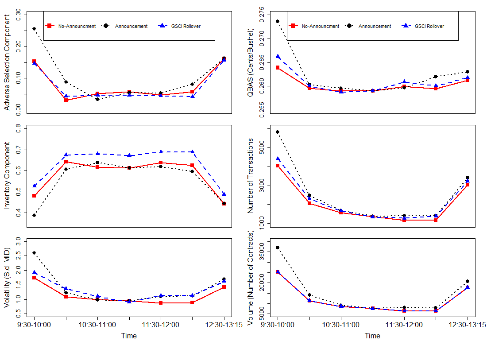
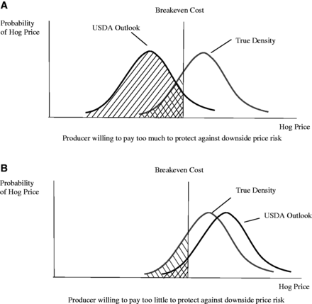
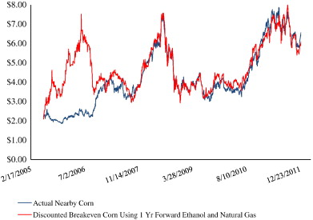
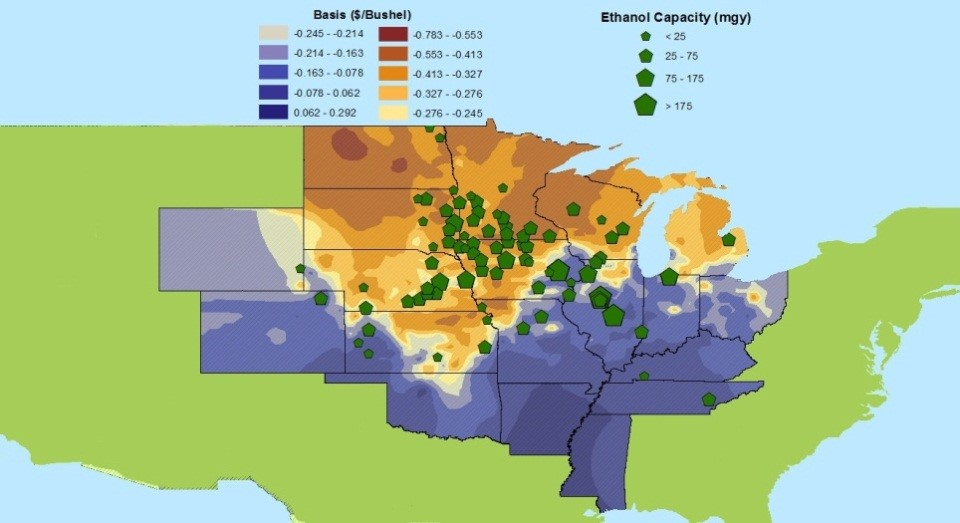
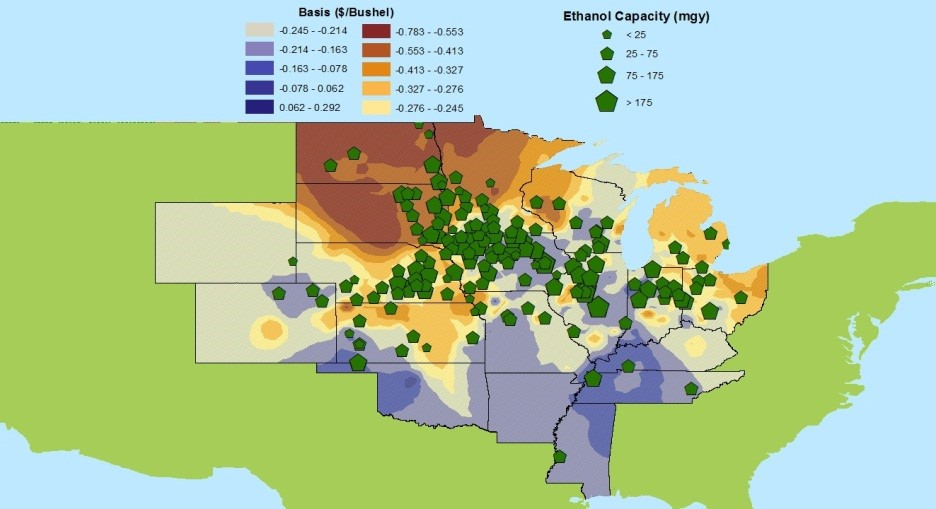
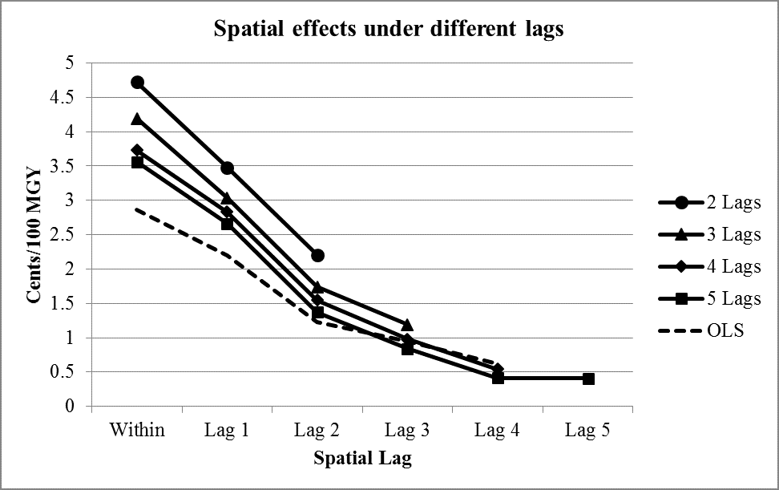
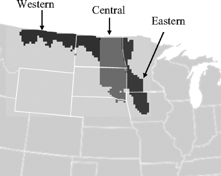
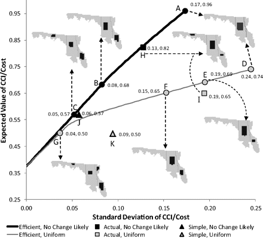
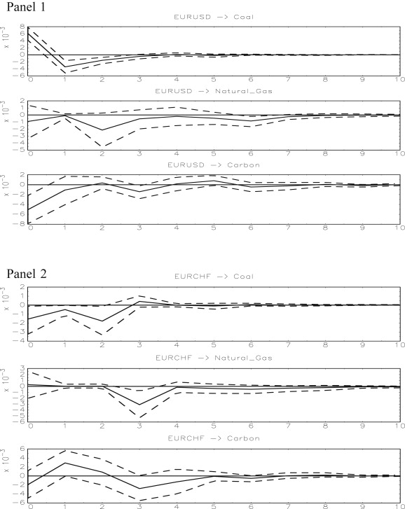

## About Me

Webpage: [mindymallory.github.io](http://mindymallory.github.io)  
email: [mallorym@illinois.edu](mallorym@illinois.edu)  
CV: [http://mindymallory.github.io/CV/](http://mindymallory.github.io/CV/)  
[Scholar](https://scholar.google.com/citations?user=bp9U6boAAAAJ&hl=en)

## Markets

My research focuses on agricultural marketing and policy. I analyze prices and risk in commodity, environmental, and natural resource markets to determine if they function in an efficient manner.

+ Commodity Futures Markets
+ Spot Commodity Markets
+ Environmental and Resource Markets

## Commodity Futures Markets 

### Microstructure

+ Liqudity Costs

  + Shang, Q., M. Mallory, and P. Garcia. 2016. “The Components of the Bid-Ask-Spread: Evidence from the Corn Futures Market.” NCCC-134 Conference on Applied Commodity Price Analysis, Forecasting, and Market Risk Management. St. Louis, MO.

  + Shang, Q., M. Mallory, and P. Garcia. 2016. “The Electronic Live Cattle Futures Market Bid Ask Spread Behaviors and Components” Agricultural and Applied Economics Association. 2016 Annual Meeting, July 31-August 2, Boston, Massachusetts
  

## Commodity Futures Markets 

### Forecasting

  + Trujillo-Barrera, A., P. Garcia, M. Mallory. 2016. “Price Density Forecasts in the U.S. Hog Market: Composite Procedures.” American Journal of Agricultural Economics. [Available here](http://ajae.oxfordjournals.org/content/early/2016/08/02/ajae.aaw050.full)  
 
  

## Commodity Futures Markets  

### Forecasting 

  + Mallory, M.L., S.H. Irwin, and D.J. Hayes. 2012. “How market efficiency and the theory of storage link corn and ethanol markets.” Energy Economics 34(6):2157–2166. [Available here](http://www.sciencedirect.com/science/article/pii/S0140988312000552%20target=)
  
  
  
  
## Spot Commodity Markets

### Corn Basis

  + Miller, B., M. Mallory, K. Baylis, and C. Hart. “Spatial Basis Effects of Corn-Belt Ethanol Plants.” [Available here](https://www.ideals.illinois.edu/handle/2142/90769)

## Spot Commodity Markets

### U.S. Corn Basis

  + Miller, B., M. Mallory, K. Baylis, and C. Hart. “Spatial Basis Effects of Corn-Belt Ethanol Plants.” [Available here](https://www.ideals.illinois.edu/handle/2142/90769)

## Environmental and Resource Markets  

### Conservation Portfolio Analysis

  + Ando, A.W., and M.L. Mallory. 2012a. “Optimal portfolio design to reduce climate-related conservation uncertainty in the prairie pothole region.” Proceedings of the National Academy of Sciences 109(17):6484–6489. [[Available here](http://www.pnas.org/content/109/17/6484.short)
  
  + Mallory, M.L., and A.W. Ando. 2014. “Implementing efficient conservation portfolio design.” Resource and Energy Economics. [Available here](http://www.sciencedirect.com/science/article/pii/S0928765514000402)
  
  + Shah, P., M. Mallory, A. Ando, and G. Guntenspergen. 2016. “Fine-Resolution Conservation Planning with Limited Climate-Change Information.” Conservation Biology forthcoming. [Available here.](http://onlinelibrary.wiley.com/doi/10.1111/cobi.12793/abstract)
  
  

Note. States and subregions in the US Prairie Pothole Region. The US part of the Prairie Pothole Region (PPR) extends through significant portions of Montana, North Dakota, South Dakota, Minnesota, and Iowa. It is shown here divided into three subregions.

## Environmental and Resource Markets  

### Conservation Portfolio Analysis

Note. Results of benefit–cost portfolio selections for two sets of probabilities. The solid areas show how 6 million acres of protected or restored habitat are allocated between the three subregions in the indicated portfolios. Points A and D maximize the average expected value of B/C for the “no change likely” and “uniform” probabilities, respectively. Points H and I show actual current Fish and Wildlife Service conservation weights in the PPR for no change likely and uniform probabilities, respectively.

## Environmental and Resource Markets

### Carbon Credit Markets

  + Yu, J., and M.L. Mallory. 2015. “An optimal hybrid emission control system in a multiple compliance period model.” Resource and Energy Economics 39:16–28. [Available here](http://www.sciencedirect.com/science/article/pii/S0928765514000773)

  + Yu, J., and M.L. Mallory. 2014. “Exchange rate effect on carbon credit price via energy markets.” Journal of International Money and Finance 47:145–161. [Available here](http://www.sciencedirect.com/science/article/pii/S0261560614000771)
  
  
  
  

  
